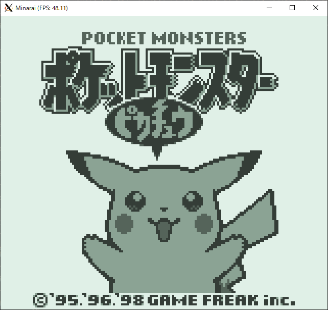

# minarai

WIP: gameboy emulator written in Elixir

## Screenshots

At the moment, Pokemon Yellow seems to be playable.  
The frame rate fluctuates quite a bit (40-80fps) and has no sound.  

## TODO
- [x] bg rendering
- [x] obj rendering
- [x] window rendering
- [ ] oam dma transfer (transfer is instantaneous atm)
- [x] joypad
- [ ] commandline options
- [ ] throttling (if it ever becomes fast enough)
- [ ] sound (if possible)

## Notes
Only hram is accessible by cpu during oam dma transfer & hram can't be the source of dma transfer  
-> The source region of dma transfer cannot be written to during the transfer  
-> Should be okay to get all source region at once, then write them to the destination region onde by one  

RLCA, RLA, RRCA, and RRA are different from RLC, RL, RRC and RR
- The z flag is always reset after RLCA, RLA RRCA or RRA regardless of the computed value
- The z flag is set accordingly after RLC, RL, RRC or RR

Lower nibble of F register is always zero
- Make sure to mask with 0xf0 when putting a value into F

"add SP n" and "ldhl sp n"
- Uses the sum of SP and the SIGNED immediate value
- Carries are calculated using the UNSIGNED immediate value

halt bug
- Occurs on halt instruction when ime=false and IE & IF != 0

Always do wrapping add when adding the scroll value
- e.g. `(ly + scy) &&& 0xff`
- Results of blargg's tests wasn't showing up because ly + scy became greater than 0xff

## blargg tests
- [x] cpu_instrs

