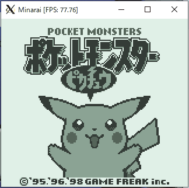

# minarai

WIP: gameboy emulator written in Elixir

To try it out, clone this repository and run the following command in the root directory of the cloned repository.  
```bash
mix minarai -b <path_to_bootrom> -c <path_to_cart>
```
Should work on Windows and Linux as long as Elixir and Erlang are set up with wxWidgets support. 

Controls are:
- A = z key
- B = x key
- Start = c key
- Select = v key
- Directions = arrow keys

## Current state
- Functional graphics
- Functional keyboard controls
- Supports mbc1 & mbc3 (no RTC functionality)
- No frame throttling (runs much faster than 59.7fps on my laptop)
- No sound
- (Pokemon Yellow is playable)
- FPS is well above 60 on average, but occasionally dips below 60 in some frames

## GIFs



## TODO
- [x] bg rendering
- [x] obj rendering
- [x] window rendering
- [ ] oam dma transfer (transfer is instantaneous atm)
- [x] joypad
- [ ] commandline options
- [ ] throttling (if it ever becomes fast enough)
- [ ] sound (if possible)

## Notes
### On elixir's performance
Single-thread performance of Elixir should be good enough to achieve 60+FPS GB emulation.  
However, I've also encountered occasional but significant drop offs in frame rates.
These drop offs coincide with full-sweep GC of the emulation process.

In order to eliminate full-sweep GC, one must avoid using a single persistent process for emulation.
I originally tried using two processes where they take turns emulating the gameboy state transitions.
When one process is running emulation, the other process runs its GC in the background.
After a certain number of emulation steps, the foreground process passes the emulation state to the background process and they switch roles.
This did not work like I expected.
BEAM's scheduler seemed to run the GC process and the emulation process serially in the same thread and caused a noticeable slowdown every time two processes switched roles.
I also experimented with process hibernation.
Instead of running GC, the background process would go into a hibernation state, limiting its memory usage.
This eliminated full-sweep GC, but there was a clear delay when the background process was woken up to relieve the foreground process.
Delay upon waking up from hibernation was much less noticeable compared to that of full-sweep GC, but still long enough to go over the latency limit.

With use of two processes not working, an alternative approach that I considered was to chain one-off emulation processes.
A running emulation process terminates after a certain number of emulation steps, but spawns the next emulation process and passes along the emulation state before termination.
If the threshold emulation step is set to a low enough number, one-off processes are killed before full-sweep GC ever happens.
A possible bottleneck in this situation is the copying of emulation state that gets passed along.
Unlike in previous approaches, the new process has to inherit everything from the old one, including immutable information like values stored in ROM.
ROM is implemented using a tuple.
Tuples have great read performance, but are expensive to copy, especially when they store multiple megabytes of data.
Elixir provides off-process storage options like ETS that do not necessitate copying of stored data when switching processes, but their read performance is not ideal for frequently read data like ROM
(I do use ETS to implement mutable memory like RAM).

I decided to use module attributes (for now).
Module attributes are only mutable during compilation and their values are stored in a module's literal pool.
Values stored as module attributes are accessible from all processes without copying.

### Some implementation details
Only hram is accessible by cpu during oam dma transfer & hram can't be the source of dma transfer  
- The source region of dma transfer cannot be written to during the transfer  
- Should be okay to get all source region at once, then write them to the destination region one by one  

RLCA, RLA, RRCA and RRA are different from RLC, RL, RRC and RR
- RLCA, RLA, RRCA, and RRA: the z flag is always reset regardless of the computed value
- RLC, RL, RRC an RR: the z flag is assigned normally (set if the computed value is zero, reset otherwise)

Lower nibble of F register is always zero
- Make sure to mask with 0xf0 when putting a value into F

"add SP n" and "ldhl sp n"
- Uses the sum of SP and the SIGNED immediate value
- Carries are calculated using the UNSIGNED immediate value

halt bug
- Occurs on the halt instruction when ime=false and IE & IF != 0

Always do wrapping add when adding the scroll value
- e.g. `(ly + scy) &&& 0xff`
- Results of blargg's tests weren't showing up because ly + scy became greater than 0xff

## blargg tests
- [x] cpu_instrs

